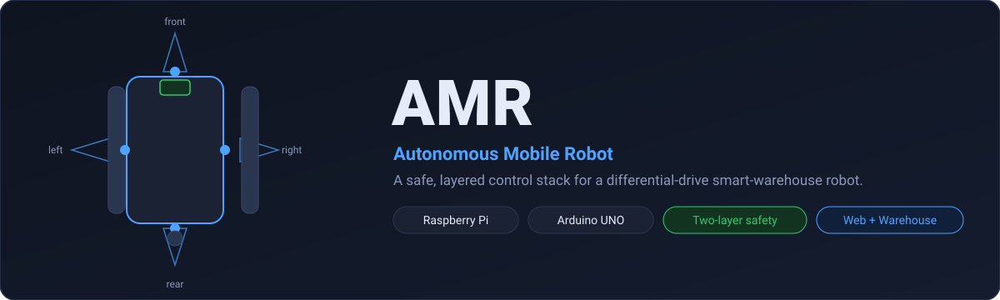
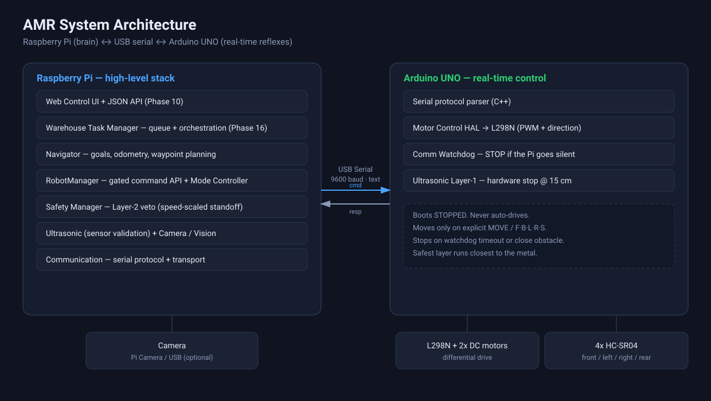
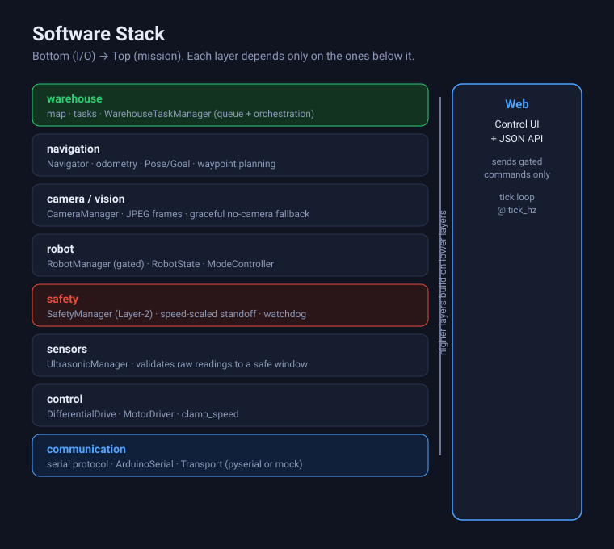
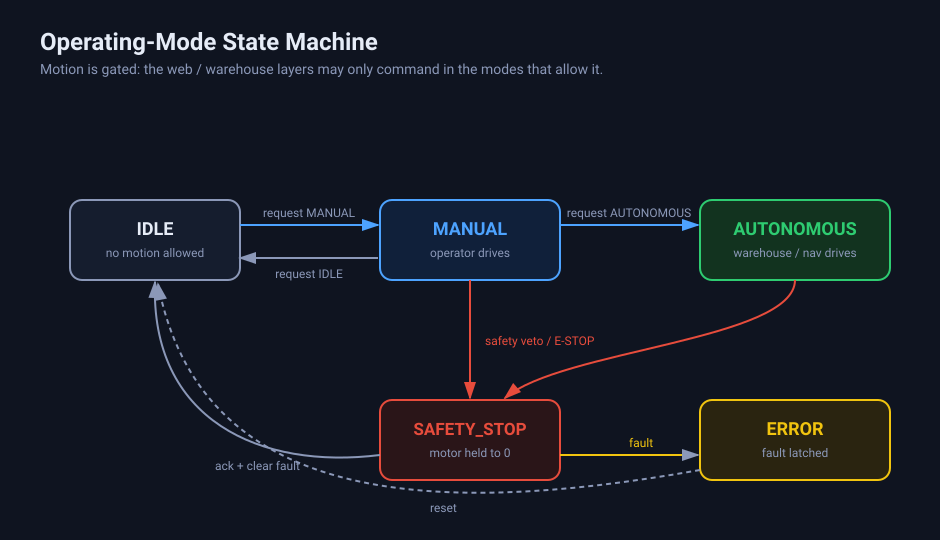
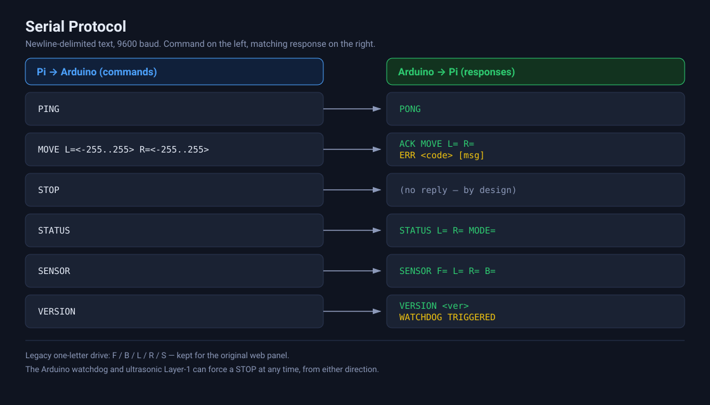
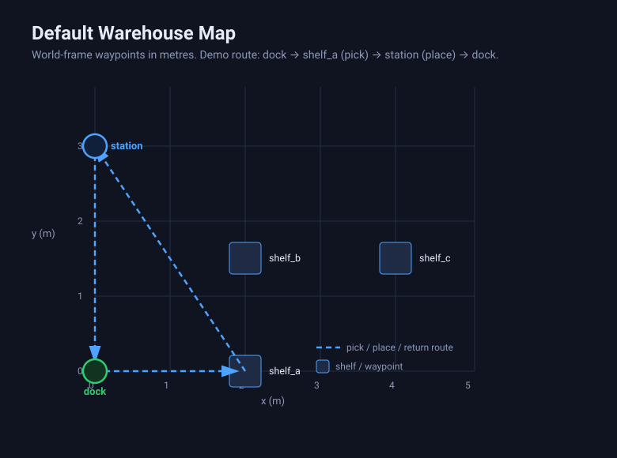

# AMR — Autonomous Mobile Robot

A safe, **layered** control stack for a differential-drive smart-warehouse robot.
A Raspberry Pi is the brain (web control, navigation, warehouse tasks) and an
Arduino UNO is the reflex system (real-time motor drive, watchdog, hardware
proximity stop). Every command is funneled through a single **gated** API so the
robot *cannot* move when safety says no.

[](https://github.com/abhijeet1267/amr/actions/workflows/ci.yml)
[](raspberry_pi/tests)
[](raspberry_pi/pyproject.toml)
[](docs/safety.md)
[](LICENSE)

| | |
|---|---|
| **Brain** | Raspberry Pi — Python 3, stdlib HTTP, `pyserial` |
| **Reflexes** | Arduino UNO — C++ firmware, L298N H-bridge |
| **Drive** | Differential, 2× DC gear motor |
| **Sensing** | 4× HC-SR04 ultrasonic (F/L/R/B) + optional camera |
| **Control** | Web panel + JSON API, warehouse task queue |
| **Safety** | 3 layers — hardware watchdog/proximity, Pi state, policy |

---

## Contents

- [Verified status](#verified-status)
- [See it work](#see-it-work)
- [Architecture](#architecture)
- [Software stack](#software-stack)
- [Operating modes](#operating-modes)
- [Repository navigation](#repository-navigation)
- [Safety model](#safety-model)
- [Serial protocol](#serial-protocol)
- [Warehouse tasks](#warehouse-tasks)
- [Web control & API](#web-control--api)
- [Configuration](#configuration)
- [Firmware (Arduino)](#firmware-arduino)
- [Installing & running](#installing--running)
- [Testing](#testing)
- [Repository layout](#repository-layout)
- [Roadmap](#roadmap)
- [License](#license)

---

## Verified status

Claims in this repo are tied to a reproducible, hardware-free test run.

| Claim | Value | Reproduce |
|---|---|---|
| Test suite | **537 passed · 2 skipped · 0 failed** | `cd raspberry_pi && python -m pytest -q` |
| Python matrix | 3.10 / 3.11 / 3.12 | `.github/workflows/ci.yml` |
| Safety thresholds | *configurable test values* | `config/safety.yaml` (`status: NOT_VERIFIED`) |
| Geometry (wheel base/dia) | *not yet measured* | `config/robot.yaml` (`null`) |

The 2 skipped tests are the camera tests that need `opencv-python`/`numpy`; they
run automatically when those are installed and skip gracefully otherwise. The
suite runs entirely on **mocks** — no serial device, no motors, no camera.

> ⚠️ `config/safety.yaml` is `status: NOT_VERIFIED` and the robot geometry is
> `null`. Every distance and wheel size is a *test value* until measured on the
> real hardware. Do not trust the robot at speed until these are verified.

---

## See it work

Several ways to run the stack — all of them safe and mockable:

```bash
cd raspberry_pi

# 1. Headless tick loop, fully mocked (no hardware, no serial)
python -m amr.main --mock

# 2. Web control panel + mock camera (open the printed URL)
python -m amr.main --mock --web

# 3. A scripted autonomous warehouse round-trip: dock -> shelf (pick) -> station (place) -> dock
python -m amr.warehouse --mock

# 4. A scripted multi-hazard scenario (gas -> human -> fire) against a mocked robot
python -m amr.hazard

# 5. Render recorded hazard events onto the warehouse map (static SVG, offline)
python -m amr.hazard.visualisation --out hazard-map.svg

# 6. Vision -> hazard pipeline using SIMULATED detections (no camera, no ML)
python -m amr.hazard.vision
```

Against the real robot the same entry points work without `--mock`; the camera
degrades gracefully if absent.

---

## Architecture

<br>



The split is deliberate: the **Pi** runs everything that can be slow or buggy
(web, planning, tasks) while the **Arduino** runs the small, safety-critical
loop that must not miss a beat. They speak a plain-text serial protocol. The
Arduino **boots stopped**, moves only on explicit commands, and can force a
stop on its own via the watchdog or a close obstacle — so a Pi crash, reboot, or
pulled cable can never leave the robot driving.

---

## Software stack

<br>



Each layer depends only on the layers below it. `web` and `warehouse` are the
top consumers; neither can reach the motors except through the gated
`RobotManager`. This is what keeps the system testable end-to-end with mocks.

---

## Operating modes

<br>



Motion is **gated by mode**: the operator drives in `MANUAL`, the warehouse /
navigation drives in `AUTONOMOUS`, and `IDLE` allows no motion at all. Any safety
trigger forces `SAFETY_STOP` (motors held at zero); leaving it requires an
explicit operator acknowledge. `ERROR` latches non-safety faults. Transitions
into `SAFETY_STOP` are deterministic; the robot never auto-releases itself.

---

## Repository navigation

| Path | Responsibility | Key types |
|---|---|---|
| `raspberry_pi/amr/main.py` | Entry point, wiring, CLI flags | `RobotManager.create_mock()` |
| `amr/robot/` | Gated command API, state, mode machine | `RobotManager`, `RobotState`, `ModeController` |
| `amr/control/` | Differential drive + motor driver | `DifferentialDrive`, `MotorDriver`, `clamp_speed` |
| `amr/communication/` | Serial protocol + transport | `ArduinoSerial`, `ArduinoSerialTransport` |
| `amr/safety/` | Deterministic Pi-side policy | `SafetyManager`, `SafetyDecision`, `SafetyAction` |
| `amr/hazard/` | Context-aware multi-hazard layer (Layer 3.5) | `HazardManager`, `HazardSource`, `HazardState`, `HazardEventLog`, `VisionHazardSource`, `VisionDetection` |
| `amr/sensors/` | Ultrasonic validation | `UltrasonicManager`, `UltrasonicReading` |
| `amr/navigation/` | Goals, odometry, waypoint planning | `Navigator`, `Pose`, `Goal` |
| `amr/warehouse/` | Task queue + orchestration (Phase 16) | `WarehouseTaskManager`, `WarehouseMap`, `Task` |
| `amr/camera/` | Camera facade (libcamera / V4L2 / mock) | `CameraManager`, `MockCamera` |
| `amr/web/` | Stdlib HTTP control panel + JSON API | `AMRWebApp` |
| `amr/mocks/` | Hardware-free doubles for tests | `MockSerial`, `MockMotor`, `MockCamera` |
| `amr/utils/` | Config loading + helpers | `load_config`, `SafetyConfig`, `RobotConfig` |
| `config/` | YAML: `robot`, `safety`, `serial`, `warehouse` | — |
| `firmware/arduino/` | Arduino C++ controller | `amr_controller.ino`, `MotorControl` |
| `docs/` | `safety`, `serial_protocol`, `web_control` | — |

---

## Safety model

Safety **always wins**. Three independent layers, each able to stop the robot on
its own (full detail in [`docs/safety.md`](docs/safety.md)). An optional
**Layer 3.5** multi-hazard layer (`amr/hazard/`, see
[`docs/hazard.md`](docs/hazard.md)) sits alongside Layer 3: it aggregates gas /
vision / robot-state / location inputs into
`NORMAL · WARNING · SLOW · STOP · EMERGENCY`, and can only ever **escalate** a
stop — never relax one. It is opt-in and off by default.

- **Layer 1 — Arduino hardware stop (last resort).** A communication **watchdog**
  (default **1000 ms**) stops the motors if no valid command arrives, and a
  **proximity stop** triggers when a *valid* reading drops below its threshold:
  **front/rear < 20 cm**, **left/right < 15 cm**. A `-1`/no-echo reading is *clear*,
  not an obstacle.
- **Layer 2 — Pi state.** The Pi keeps a structured `RobotState` (sensors,
  connection, drive, safety) and polls `STATUS` / `SENSOR`.
- **Layer 3 — Pi policy.** `SafetyManager.check()` returns a deterministic
  decision — `PROCEED` / `WAIT` / `STOP` (plus reserved `TURN`/`REPLAN`). Rules,
  first match wins: disconnected → `STOP`; no valid data → `STOP`; any reading
  below its stop threshold → `STOP`; any reading below `2.0×` threshold → `WAIT`;
  else `PROCEED`.

**Emergency stop** is always available: software E-STOP (web/API) sends `STOP`
and sets `SAFETY_STOP`; the watchdog fires automatically on loss of commands; a
physical disconnect always works. **Power rule:** motors are powered by the
L298N external supply — never the Pi or Arduino 5 V rails.

> Aggressive autonomous obstacle avoidance is intentionally **not** implemented.
> Only immediate, deterministic stops.

---

## Serial protocol

<br>



Newline-delimited text at **9600 baud**. The Pi sends commands; the Arduino
answers with `PONG`, `ACK …`, `ERR <code>`, `STATUS L= R= MODE=`,
`SENSOR F= L= R= B=`, `VERSION <ver>`, or unsolicited `WATCHDOG TRIGGERED`.
`STOP` intentionally returns nothing. Legacy one-letter drive commands
(`F`/`B`/`L`/`R`/`S`) remain for the original panel. The watchdog is tunable at
runtime with `WDT <ms>`. See [`docs/serial_protocol.md`](docs/serial_protocol.md).

---

## Warehouse tasks

<br>



Phase 16 adds a **task queue + orchestrator** that runs end-to-end against the
mocks. The map (`config/warehouse.yaml`) is a set of world-frame waypoints
(`{x, y, theta}` in metres); the robot starts at the `dock`. The demo route is
`dock → shelf_a (pick) → station (place) → dock`.

- **`WarehouseTaskManager`** queues tasks (bounded by `queue_max`, default 16) and
  drives them to completion under the same lock discipline as the web loop.
- **Task types** — `PICK`, `PLACE`, `RETURN` (and compound round-trips) compose
  `Navigator` goals with a **manipulator** backend (`mock` records picks/places;
  `null` is a no-op). Real gripper/ARM hardware plugs into
  `amr.warehouse.tasks.Manipulator`.
- **Motion tuning** — `task_speed` 0.5 m/s, `turn_speed` 1.0 rad/s,
  `wheel_base_m` 0.30 (overridden by measured `robot.wheel_track_m` when set).

---

## Web control & API

A **stdlib-only** HTTP panel — no build step, no external assets. It adds no new
capabilities: every command goes through the gated `RobotManager`, so a safety
veto, illegal mode transition, or a dropped link all surface as `HTTP 400`.

| Method | Path | Description |
|---|---|---|
| GET | `/` | Self-contained control panel |
| GET | `/status` | Full robot snapshot (JSON) |
| GET | `/sensor` | One sensor poll + safety decision (JSON) |
| GET | `/camera` | Camera status (JSON) |
| GET | `/image` | One JPEG frame (`image/jpeg`, or `503` unavailable) |
| GET | `/hazard` | Hazard layer status (JSON; `attached: false` when not wired) |
| POST | `/command` | Execute one command (JSON in/out) |
| POST | `/hazard/acknowledge` | Release a latched hazard `EMERGENCY` (step 1 of the two-step release; never resets the robot mode) |

`POST /command` accepts `estop`, `stop`, `mode`, and drive commands
(`forward`, `backward`, `rotate_left`, `rotate_right`, `turn_left`,
`turn_right`). `estop`/`stop` are **never gated**. The panel polls `/status`
every 500 ms, `/hazard` every second, and the camera every 2 s; a background
control thread calls `tick()` at 5 Hz. There is **no authentication** — this is
a single-operator LAN tool; never expose the port to the internet. Details in
[`docs/web_control.md`](docs/web_control.md).

---

## Configuration

All config lives in [`config/`](config) and is loaded by `amr/utils/config.py`.

| File | Highlights |
|---|---|
| `robot.yaml` | robot name, `wheel_track_m`/`wheel_diameter_m` (**`null`** until measured), `motors.max_speed` 255, ultrasonic pins (`TODO_VERIFY`), camera `pi` 1280×720 |
| `safety.yaml` | `watchdog_timeout_ms` 1000, stop distances F/R 20 · L/R 15, valid window 2–400 cm, `status: NOT_VERIFIED` |
| `serial.yaml` | `port` `/dev/ttyACM0`, `baudrate` 9600, per-command timeouts, `protocol_version` `1.0` |
| `warehouse.yaml` | `enabled`, `dock`, task/turn speed, `wheel_base_m`, `queue_max` 16, `manipulator: mock`, `locations` map |

Values marked `null` / `TODO_VERIFY` / `NOT_VERIFIED` are placeholders that must
be filled from the physical robot before autonomous use is trusted.

---

## Firmware (Arduino)

The controller lives in [`firmware/arduino/amr_controller/`](firmware/arduino/amr_controller):
`amr_controller.ino` plus small C++ HAL modules (motor control, watchdog,
ultrasonic, serial protocol). Key properties:

- **Boots stopped** — drives only on explicit `MOVE` / legacy drive commands.
- **Watchdog** — auto `STOP` after `watchdog_timeout_ms` of silence.
- **Proximity stop** — immediate hardware stop below the Layer-1 thresholds.
- **L298N H-bridge** — PWM + direction for the two DC motors.

Build & flash with the Arduino IDE or `arduino-cli` for an **UNO** board.

---

## Installing & running

```bash
# 1. Clone
git clone https://github.com/abhijeet1267/amr.git && cd amr

# 2. Python environment (Pi or desktop — the suite is hardware-free)
cd raspberry_pi
python -m venv .venv && source .venv/bin/activate
pip install -e ".[dev]"        # runtime deps + pytest/ruff

# 3. Run (fully mocked)
python -m amr.main --mock --web

# 4. Flash the firmware
#    open firmware/arduino/amr_controller with the Arduino IDE and upload to the UNO
```

Camera is optional: the panel, tests, and mock all work with **no** camera. On a
real Pi, `device: "pi"` uses `libcamera-still`; `"v4l2"` uses OpenCV.

---

## Testing

```bash
cd raspberry_pi
python -m pytest -q                 # full suite
python -m pytest -q tests/test_web_server.py   # one area
```

The 18 test files cover protocol parsing, the mode state machine, the safety
policy (including the C6 obstacle-avoidance policy
`tests/test_avoidance.py` — turn/replan, stop priority, loop guard,
determinism), differential-drive math, odometry/navigation, the warehouse task
manager, the camera manager, the hazard layer, the vision-to-hazard pipeline
(`tests/test_vision.py`, simulated detections only), and a real
`ThreadingHTTPServer` driven against the
mock stack (mode gating, safety rejection, speed bounds, E-STOP, camera
endpoints). Everything runs on the mocks under `amr/mocks/`.

---

## Repository layout

```
.
├── assets/                     # README diagrams (SVG)
├── config/
│   ├── robot.yaml              # identity, geometry, motors, sensors, camera
│   ├── safety.yaml             # watchdog + stop distances (NOT_VERIFIED)
│   ├── serial.yaml             # Pi <-> Arduino link
│   ├── warehouse.yaml          # map, task tuning, manipulator
│   └── hazard.yaml             # hazard thresholds, kinds, zones (NOT_VERIFIED)
├── docs/
│   ├── safety.md               # layered safety model
│   ├── serial_protocol.md      # wire protocol reference
│   ├── web_control.md          # web panel + HTTP API
│   └── hazard.md               # context-aware multi-hazard safety layer
├── AI_CONTEXT/                 # shared context for the multi-agent team
│   ├── PROJECT_CONTEXT.md  CURRENT_STATUS.md  ARCHITECTURE.md
│   └── TASK_BOARD.md  HANDOFF.md
├── firmware/
│   └── arduino/amr_controller/ # amr_controller.ino + C++ HAL
├── raspberry_pi/
│   ├── amr/                    # the Python control stack
│   │   ├── main.py             # entry point + CLI
│   │   ├── robot/  control/  communication/
│   │   ├── safety/  hazard/  sensors/  navigation/
│   │   ├── warehouse/  camera/  web/  mocks/  utils/
│   ├── tests/                  # pytest suite (16 files)
│   └── pyproject.toml          # packaging + [dev] extras
├── .github/workflows/ci.yml    # pytest matrix + ruff
├── LICENSE
└── README.md
```

---

## Roadmap

Phases are delivered incrementally with the test suite as the safety net. The
core is in place (communication → control → safety → sensors → robot → camera →
navigation → warehouse). Explicit next steps:

1. **Verify** — measure wheel geometry and confirm safety thresholds on the real
   robot, then flip `config/safety.yaml` to `VERIFIED` and fill `robot.yaml`.
2. **Localization** — real odometry + a simple map/pose estimate to back
   `Navigator` on hardware.
3. **Obstacle avoidance** — promote `SafetyAction.TURN` / `REPLAN` from reserved
   to active policy.
4. **Manipulation** — replace the `mock` manipulator with real gripper/ARM I/O.
5. **Vision** — build marker/QR/shelf recognition on `CameraManager.capture()`.
6. **Hazard hardware & telemetry** — wire real gas/smoke/fire sensors into
   `amr/hazard` and surface `HazardManager.snapshot()` plus the spatial event
   history in the web panel and a live dashboard. The offline map renderer
   already exists (`python -m amr.hazard.visualisation` → SVG);
   `config/hazard.yaml` is still `NOT_VERIFIED` and has no sensor hardware
   behind it.
7. **Real camera backend** — C5 ships a framework-independent vision→hazard
   contract (`amr/hazard/vision.py`) driven by a deterministic **simulated**
   detector. A real backend (OpenCV / YOLO / Jetson) can be plugged in behind
   the same `VisionDetector` protocol without changing the hazard system. No
   camera or ML model has been run or measured, and no detection accuracy is
   claimed.

---

## License

[MIT](LICENSE) © 2026 abhijeet1267.
